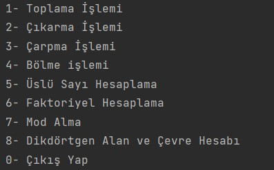
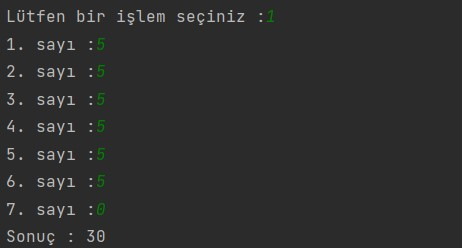
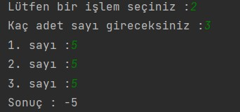
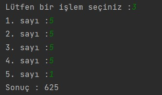
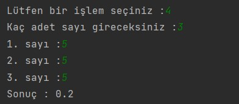
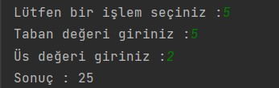
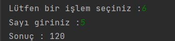
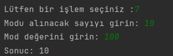
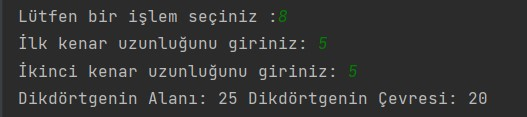

# Gelişmiş Hesap Makinesi
Java ile kullanıcın seçtiği işlemleri yapan hesap makinesi yapıyoruz.

## Hesap makinesinin fonksiyonları :

## Senaryolar

## Senaryo 1

## Senaryo 2

## Senaryo 3

## Senaryo 4

## Senaryo 5

## Senaryo 6

## Senaryo 7

## Senaryo 8

